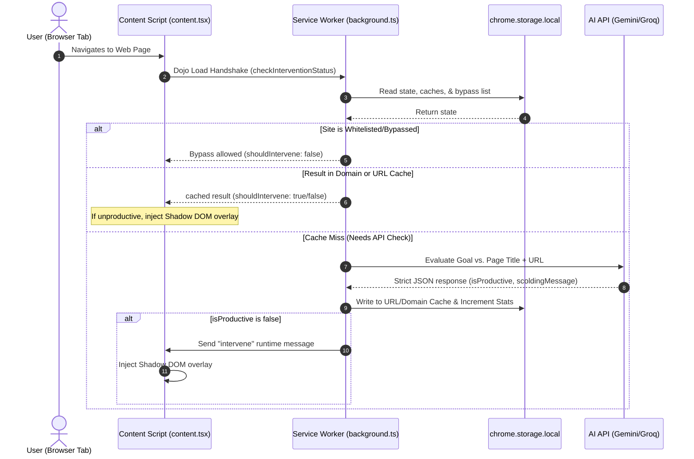

# Oji-San: AI Dojo Focus Master — Product Knowledge Base

Oji-San is an advanced, context-aware Chrome Extension (Manifest V3) designed to enforce web browsing discipline. Under the persona of **Master Oji-San**—the strict, eccentric grandmaster of the 36th Chamber of Code—it uses large language models (LLMs) to verify whether a user's web browsing aligns with their active study or work goals. If the user wanders off-topic, Oji-San intercepts the browser viewport with martial-arts-themed scolding overlays.

---

## 1. Product Concept & Positioning

### The Problem
Traditional website blockers are "dumb" list-based utilities. They block entire domains (e.g., `youtube.com` or `github.com`), which is counterproductive since these sites host both highly valuable educational materials (React tutorials, coding repositories) and major distractions (cat videos, social feeds).

### The Solution: Oji-San AI Dojo
Oji-San acts as a smart guardian. It evaluates the **context** of the specific page (URL, page title, and active user goal) rather than just the domain.
* **Goal-Aligned Access**: A user whose goal is "Learn AWS" can visit a YouTube tutorial on "AWS S3 Setup" but will be blocked if they click a video on "Top 10 Gaming Fails."
* **Gamification & Engagement**: Focus metrics are gamified using a martial arts hierarchy. Disobedience depletes the user's "Focus Stamina" (health bar) and impacts their Dojo Rank.
* **Aesthetics & Bulletproof UI**: Styled with a distinctive, high-fidelity dark-retro arcade aesthetic, featuring pixel-art sprites and custom typography. The UI is built to be "bulletproof" against host website CSS leaking or Content Security Policy (CSP) blocking by using a Shadow DOM, inline SVG icons (Lucide React), explicit hex colors instead of semantic Tailwind classes, and inline system font fallbacks.

---

## 2. Core Features

### 1. The Dojo Gate (Context-Aware Blocker)
* **Function**: Intercepts web navigation in real-time, sending page details to an LLM for productivity evaluation relative to the user's active goal.
* **Intervention**: If classified as unproductive, the content script builds a full-screen, blur-backdrop card displaying a tailored, scolding message from Master Oji-San.
* **User Escape Hatches**:
  * **Forgive me, Oji-San (Close Tab)**: Immediately closes the distracting tab.
  * **I am actually working (Request Bypass)**: Temporarily whitelists the current domain/host for the session, allowing the user to bypass the block if the AI misclassified a valid page.

### 2. YouTube Shield (Unhook Mode)
An AI-free, zero-latency CSS and DOM filtering module that removes distracting UI components on YouTube:
* **Home Feed Lock**: Hides the main feed recommendations grid, replacing it with a centered Dojo banner prompting the user to search directly for their active goal.
* **Sidebar Hider**: Collapses watch-page video recommendation sidebars.
* **Comments Lock**: Hides comment sections to prevent endless scrolling.
* **Active Player Blocker**: Integrates with the context blocker to check individual video watch paths (`/watch`) while allowing search and home feeds to remain visible for searching.

### 3. Dual LLM Provider Support
Provides flexibility to toggle between two major API providers inside the dedicated settings page:
* **Google Gemini**: Integrates with `gemini-2.5-flash` or `gemini-2.0-flash` models.
* **Groq Cloud**: Integrates with high-performance open models like `openai/gpt-oss-20b` (Recommended), `llama-3.3-70b-versatile`, or `llama-3.1-8b-instant`.

### 4. Sparring Stats & Gamification
Tracks and displays browser discipline:
* **Pages Evaluated**: Total URLs checked during the active session.
* **Distractions Slashed**: Number of blocked distracting pages.
* **Discipline Rating**: 
  * `ZEN MASTER` (0 distractions slashed - perfect focus)
  * `DISCIPLED` (1–2 distractions slashed)
  * `INITIATE` (3–5 distractions slashed)
  * `SLACKER` (More than 5 distractions slashed)

---

## 3. Technical Architecture & Data Flow



### Key Components

#### 1. Configuration (`src/background/config.ts`)
Defines the `systemPrompt` used for all LLM calls, enforcing strict JSON schemas. It also maintains a list of `multiPurposeDomains` which bypass domain-wide caching.

#### 2. LLM Providers (`src/background/providers/`)
Built using the Factory design pattern:
* `LLMProvider` (Abstract base interface)
* `GeminiProvider`: Connects to Google's API, utilizing native JSON Schema declarations to enforce the response structure:
  ```json
  {
    "type": "OBJECT",
    "properties": {
      "isProductive": { "type": "BOOLEAN" },
      "scoldingMessage": { "type": "STRING" }
    },
    "required": ["isProductive", "scoldingMessage"]
  }
  ```
* `GroqProvider`: Sends messages to Groq's completions endpoint with `response_format: { type: "json_object" }` and a low temperature (0.2) to maintain structure.
* `getProvider(...)`: Resolves the active provider dynamically at runtime.

#### 3. Storage Utility (`src/utils/storage.ts`)
Wraps the asynchronous `chrome.storage.local` API. It includes a fallback to `localStorage` when running in a standard web browser context, enabling rapid development and automated testing outside Chrome.

#### 4. Background Service Worker (`src/background.ts`)
The orchestrator of the extension lifecycle:
* Listens to tab transitions using `chrome.tabs.onUpdated` and `chrome.tabs.onActivated`.
* Maintains an active locks registry (`inFlightEvaluations: Set<string>`) to intercept and prevent duplicate concurrent API requests for the same URL.
* Directs tab closures via `chrome.tabs.remove` and whitelist additions when bypassed.

#### 5. Content Script & Shadow DOM Mount (`src/content.tsx`, `shadow.ts`)
Handles DOM manipulations safely:
* **Style Isolation**: Mounts the intervention UI within an isolated Shadow DOM (`oji-san-intervention-root`). This prevents target host stylesheets (like Netflix, YouTube, or Facebook) from overriding or breaking the Dojo UI layouts.
* **Handshake Protocol**: Instantly checks caching states with the background worker on load, rendering blocks before the page completely loads to minimize flash of unblocked content (FOUC).

---

## 4. Performance & API Optimization

To prevent excessive API resource usage and rate limits, Oji-San implements multiple efficiency layers:

### 1. Dual-Tier Caching System
* **Domain-Level Cache**: For single-purpose domains (e.g. `netflix.com`, `reddit.com`, `instagram.com`). Once Oji-San classifies one page on these domains as distracting, the entire domain is cached as blocked for the rest of the session.
* **URL-Level Cache**: Reserved for multi-purpose domains (configured in `multiPurposeDomains` as `['youtube.com', 'github.com', 'google.com', 'wikipedia.org', 'localhost', '127.0.0.1', 'chatgpt.com', 'claude.ai', 'gemini.google.com', 'perplexity.ai', 'poe.com']`). These are cached individually, allowing a user to read a wiki article on "Quantum Mechanics" while blocking "List of anime episodes", or letting them ask Claude for coding help without banning the whole AI tool.

### 2. In-Flight Lock Registry
Modern websites make rapid redirections or trigger multiple `chrome.tabs.onUpdated` state updates during load. Oji-San locks the URL in a local `Set` variable before the API fetch starts. Any subsequent concurrent triggers for that exact URL are discarded until the API resolves and removes the lock.

### 3. Base64 Asset Injection & CSP Bypass
To bypass third-party websites' strict Content Security Policies (CSP), which block external media loading:
* All images and visual resources (such as Oji-San's main character sprite) are bundled directly inside the TypeScript bundle as Base64 data URLs.
* External web fonts (like Google Fonts) are avoided in the content script; instead, the UI relies on inline system font fallbacks (`Impact`, `ui-monospace`) and inline React SVGs (`lucide-react`) to guarantee pixel-perfect rendering even on highly restrictive sites like Amazon.

---

## 5. Potential Analysis Directions for NotebookLM

When uploading this document to NotebookLM, you can query and explore several strategic improvements:
1. **Dojo AI Persona tuning**: How to optimize the `systemPrompt` to reduce false positives (e.g., when learning code on GitHub but looking at a repository readme that has a humorous name).
2. **Offline Mode Options**: Brainstorming how to run local lightweight models (e.g., WebGPU WebLLM, Chrome Prompt API) to avoid external API calls entirely.
3. **Advanced Stats Tracking**: Designing a weekly report structure or focus trend analysis database schema inside the chrome local storage.
4. **YouTube Search Auto-Injection**: Strategies to capture the active search query on YouTube and match it semantically with the user's active goal before the results render.
